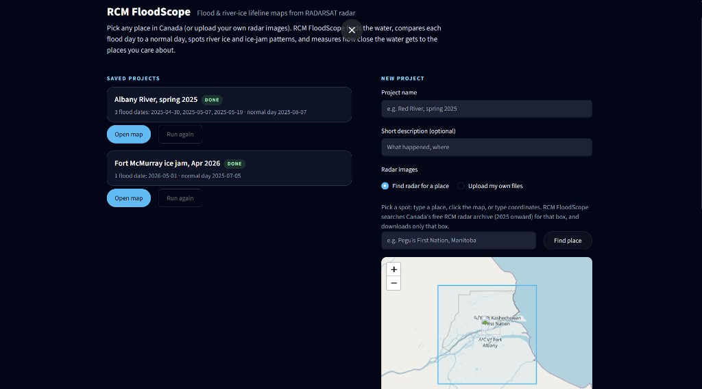
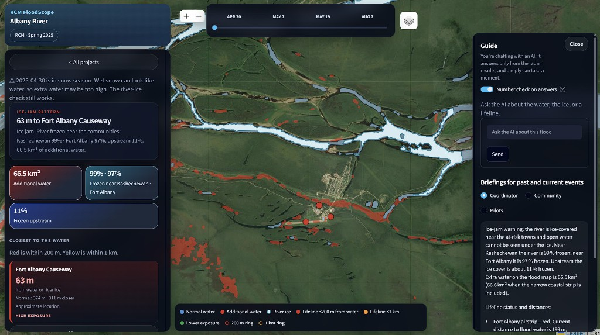

# RCM FloodScope

RCM FloodScope maps river floods from Canada's RADARSAT Constellation Mission (RCM) radar and measures how close the water gets to the places people depend on: airstrips, causeways, roads, and the towns themselves. It also checks for ice jams, which are what actually back the water up.

It was built for Mission Accepted, Challenge 3. The worked example is the spring 2025 Albany River flood at Fort Albany and Kashechewan, two fly-in First Nations on James Bay. The same app can open any other place in Canada that the free RCM archive covers, or a pair of radar images you upload yourself.

## A quick look

The projects page. Open a saved project, or start a new one by picking a place in Canada or uploading your own radar images.



The Albany River on April 30, 2025. Red is extra water, light blue is river ice, and the dots are lifelines coloured by how close the water is. The Guide panel on the right answers questions from the radar results.



## Team

- Aryan Shashikumar Srivastava
- Anshdeep Singh Bhachoo
- Rayyan Azher Miswani
- Adi Sahota
- Jay Sarju Patel

## Why radar

Fort Albany and Kashechewan flood when spring ice breaks up, jams, and the river has nowhere to go. In 2025 Kashechewan evacuated in mid-April and Fort Albany declared an emergency on April 29–30. Optical satellite photos fail here because of cloud, darkness, and snow. Radar sees through all of that.

Smooth water looks dark on radar. Ice and rough land look bright. RCM FloodScope turns each radar scene into a water map, compares a flood day with a normal summer day, and treats water that is present on the flood day but not on the normal day as the flood. It then measures the distance from that water to each lifeline.

Ice jams are a separate check. Inside the river's normal channel, anything that is not water on a flood date is treated as ice. If the river is mostly frozen beside the towns and mostly open upstream, water coming downstream has nowhere to go. That pattern is the jam warning.

## Tech stack

Python 3.10 or newer.

| Piece | What it is |
| --- | --- |
| Dashboard | [Streamlit](https://streamlit.io/). The map page and the projects page both live in `frontend/`. |
| Map | [Folium](https://python-visualization.github.io/folium/) and [streamlit-folium](https://github.com/randyzwitch/streamlit-folium), drawn on Leaflet. |
| Charts | [Altair](https://altair-viz.github.io/). |
| Rasters and vectors | [rasterio](https://rasterio.readthedocs.io/), [GeoPandas](https://geopandas.org/), [Shapely](https://shapely.readthedocs.io/), [pyproj](https://pyproj4.github.io/pyproj/). |
| Image math | NumPy, pandas, SciPy, scikit-image, scikit-learn. Phase correlation lines a shifted scene up with the normal day. |
| Radar catalog | [pystac-client](https://pystac-client.readthedocs.io/) against the EODMS STAC catalog. Scenes are RCM analysis-ready data (`rcm-ard`) from the public AWS bucket. Downloads are unsigned (`AWS_NO_SIGN_REQUEST`). |
| Place names | OpenStreetMap Nominatim, limited to Canada. |
| Assistant | [Groq](https://groq.com/). Default model `openai/gpt-oss-120b`, fallback `openai/gpt-oss-20b`. Without a key, alerts and answers still come from templates and the files on the page. |
| HTTP API | [FastAPI](https://fastapi.tiangolo.com/) and [uvicorn](https://www.uvicorn.org/). The dashboard does not need this process. It calls the same Python modules directly. |

## How to run

From the repo root:

```bash
python -m venv .venv
source .venv/bin/activate
pip install -r requirements.txt
cp .env.example .env
```

Put a Groq key in `.env` if you want the model. The file is gitignored.

To get a free key, sign up at [console.groq.com](https://console.groq.com), open **API Keys**, click **Create API Key**, and copy it (it is only shown once). Paste it after `GROQ_API_KEY=` and leave the two model lines as they are. Never commit the key.

```
GROQ_API_KEY=
LLM_MODEL=openai/gpt-oss-120b
LLM_FALLBACK_MODEL=openai/gpt-oss-20b
```

### Dashboard

```bash
streamlit run frontend/app.py
```

Open http://localhost:8501. The first screen is saved projects. **Open map** on Albany River, spring 2025 loads the flood the rest of this README describes. Fort McMurray is a second saved project (May 1, 2026 against a July 5, 2025 normal day).

On a map:

- The date slider moves between flood days and the normal day.
- Blue is water on the normal day. Red is extra water on the selected flood day. Bright river ice is its own layer.
- Lifeline dots are red within 200 m of water, yellow within 1 km, and green beyond that.
- Guide is the chat. It answers from the radar results for the open project. A number check compares figures in the reply with the files.
- Coordinator, Community, and Pilots are three wordings of the same day's numbers.
- **Download situation report** saves a markdown report for the project on screen.

### API

Optional. Same questions, alerts, and layers over HTTP, for the Albany `data/real` folder:

```bash
uvicorn api.main:app --reload
```

| Method | Path | What it returns |
| --- | --- | --- |
| GET | `/api/dates` | Flood dates and the normal date |
| GET | `/api/dates/{date}/summary` | Stats, ice, lifelines, alert |
| GET | `/api/layers/normal` | Normal-day water GeoJSON |
| GET | `/api/dates/{date}/layers/{kind}` | `extra`, `ice`, or `water` GeoJSON |
| POST | `/api/ask` | `{ "question", "history" }` |
| POST | `/api/infer` | Checked answer with claims |
| POST | `/api/alert` | `{ "date", "audience" }` where audience is `coordinator`, `community`, or `pilots` |
| GET | `/api/report` | Situation report as markdown |

### Pipeline by hand

Search the free archive for the Albany box (summer 2025 and the spring flood window) and download one scene by the number it prints:

```bash
python pipeline/get_ard_baseline.py
python pipeline/get_ard_baseline.py 3
```

Run a saved project from its `project.json` and `inputs/` rasters:

```bash
python pipeline/run_project.py albany-2025
```

A project folder looks like `data/real`:

```
data/projects/<slug>/
  project.json
  inputs/<date>.tif
  lifelines.json
  normal_<date>_water.geojson
  flood_<date>_water.geojson
  <date>/stats.json
  <date>/ice_stats.json
  <date>/lifelines_status.json
  <date>/alert.json
  <date>/flood_extra.geojson
  <date>/river_ice.geojson
```

`project.json` records the area, projection, pixel size, and water cutoff, including whether each value was detected or typed in. Edit it and run the project again. Raw inputs and the large `*_db.tif` files are gitignored, so **Run again** only works on the machine that still has those files. Opening a finished project does not need them.

One scene, if you are not using `run_project`:

```bash
python pipeline/water_mask.py hh.tif hv.tif data/real/flood_2025-05-07 --kind ard --band HV
python pipeline/analyze.py data/real/normal_2025-08-07_water.geojson \
  data/real/flood_2025-05-07_water.geojson data/real/flood_2025-05-07_mask.tif \
  data/lifelines.json data/real/2025-05-07
python pipeline/ice.py data/real/normal_2025-08-07_mask.tif \
  data/real/flood_2025-05-07_mask.tif data/lifelines.json data/real/2025-05-07
python ai/alerts.py data/real/2025-05-07
```

Apr 30 is an uncalibrated EODMS GRD product and sits about 40 m off the other scenes. Rebuild it with `--band HV --threshold 47.5 --shift-px 2,0`, then run ice with its own cutoff before analyze, because distances use the ice map:

```bash
python pipeline/ice.py data/real/normal_2025-08-07_mask.tif \
  data/real/flood_2025-04-30_mask.tif data/lifelines.json data/real/2025-04-30 \
  --db data/real/flood_2025-04-30_db.tif --ice-threshold 49.5 --median 7
```

The `_db.tif` files are not in git. Regenerate them with `water_mask.py` before that ice command.

## A new project

On the landing page, name the project and pick a radar source.

**Find radar for a place.** Type a Canadian place, click the map, or enter latitude and longitude. Set the box size and a date range for a normal summer day and for the flood. Search lists RCM scenes from the free archive (2025 onward) and pre-selects a matching pair. The download is cropped to your box.

**Upload files.** One normal-day image and at least one flood-day image of the same place. Use `rr.tif` for AWS analysis-ready data, or `HV.tif` for an EODMS order. Each file needs its own `YYYY-MM-DD` date.

Lifelines are optional: name, type (`community`, `airstrip`, `causeway`, `road`, or `other`), latitude, and longitude, or a CSV. Towns should be type `community`. That is what turns the ice-jam check on. With no towns, the app still reports how much of the river is frozen, but it does not call a jam.

Processing takes about 30 seconds to a few minutes, then the map opens.

Nov–Apr scenes get a snow warning. Wet snow and frozen bogs can look like water, so extra water can be too high. The ice check still runs. A fully automatic Albany run is close to the hand-tuned one but not identical: about 41 km² of extra water on Apr 30 instead of 66.5 km², with the same ice-jam call.

## Albany River, spring 2025

| Date | Role | Source |
| --- | --- | --- |
| Apr 1, 2025 | Ice-only reference. Not a flood number. | RCM ARD, same pass as May 7, May 19, and Aug 7 |
| Apr 30, 2025 | Emergency night | EODMS order, 12.5 m, uncalibrated |
| May 7, 2025 | One week later | RCM ARD from AWS, 20 m |
| May 19, 2025 | Water draining | RCM ARD from AWS, 20 m |
| Aug 7, 2025 | Normal day | RCM ARD from AWS, 20 m |

The free AWS archive starts in 2025. Year-by-year checks found nothing for 2019–2024 anywhere in Canada, so the normal day is the summer after the flood, not before it. The archive also has a gap over this river from Apr 8 to May 6, during breakup, which is why Apr 30 exists only as an EODMS order.

Apr 1 is frozen everywhere, including upstream, so it is not a jam. Flood numbers are not computed for it: in early April, wet snow and frozen bogs look dark and get counted as water. Those same dark patches show up on Apr 30, which is why most of the red away from the river that night is not flood.

Extra water along the river, with the James Bay shore left out, was about **66.5 km² on Apr 30**, **20.7 km² on May 7**, and **13.0 km² on May 19**. With the shore included, May 7 was 67.0 km² and May 19 was 20.1 km². Both figures are in `stats.json`. Do not compare Apr 30 straight against the May numbers: it is a different product, and a lot of the river was still under ice, so the flood beside Kashechewan is probably under-counted. The ice detector is the record for that night.

On the emergency night, water got within roughly 60–200 m of Fort Albany's airstrip and causeway area. On the normal day those distances are about 370–490 m. That matches reporting that the causeway was less than a foot from overflowing.

Ice, in `outputs/ice_timeline.png`:

- Apr 1: 97–99% frozen everywhere, upstream included.
- Apr 30: 97–99% frozen within 5 km of both towns, about 11% frozen upstream. That is the jam pattern.
- May 7: open at Fort Albany, about 30% frozen at Kashechewan.
- May 19: essentially open.

The near-town frozen fraction stays at 93–100% across cutoffs and smoothing, so it is not an artifact of one setting.

## What is in the repo

| Path | Role |
| --- | --- |
| `frontend/app.py` | Map, timeline, lifelines, ice, charts, Guide, alerts, report download |
| `frontend/projects.py` | Saved projects and the new-project form |
| `frontend/factcheck.py` | Checks numbers in Guide's answers against the radar files |
| `frontend/ai_bridge.py` | Turns a checked model reply into the chat card |
| `frontend/style.css` | Map overlay and landing-page layout |
| `pipeline/water_mask.py` | Radar scene to a water mask and GeoJSON |
| `pipeline/analyze.py` | Extra water and lifeline distances |
| `pipeline/ice.py` | Ice-jam detector |
| `pipeline/archive.py` | Search and download any box from the public RCM archive |
| `pipeline/get_ard_baseline.py` | List and download Albany scenes |
| `pipeline/run_project.py` | Run one saved project end to end |
| `ai/llm.py` | Questions, audience alerts, situation report |
| `ai/inference.py` | One-call checked answers, knowledge search, disk cache |
| `ai/alerts.py` | Plain-language alert writer. `python ai/alerts.py <folder>` |
| `api/main.py` | FastAPI routes |
| `api/data.py` | Reads `data/real` for the API |
| `data/real/` | Albany results used by the API and the original pipeline commands |
| `data/projects/` | Saved projects. Albany is `albany-2025` |
| `data/knowledge/` | Short sourced notes the assistant can search |
| `outputs/flood_story.png` | Before/after figure |
| `outputs/ice_jam.png` | Frozen river on Apr 30 against open water on May 7 |
| `outputs/ice_timeline.png` | Apr 1, Apr 30, May 7, May 19 |

The raw radar scenes are not in git. `get_ard_baseline.py` or the landing-page search can fetch the AWS scenes again. Apr 30 still requires the EODMS order.

## Limits

- Apr 30 is uncalibrated and was shifted about 40 m (`--shift-px 2,0`) so it lines up. Some upstream ice it flags can be noise because the picture is grainier.
- Ice is not counted as open water. On Apr 30 the river beside the towns was still frozen, so the red flood extent understates the water that was there.
- Distances count open water, river ice, and the normal channel. A frozen river is still the river. The open-water-only distance is saved as `dist_open_water_m`.
- Red away from the channel can be meltwater, wet snow, or radar speckle. The red along the river is the part to use.
- Causeway and town-centre points are approximate unless a lifeline is marked verified.
- The normal day is August 2025, after the flood, because the free archive has no earlier summer.
- Nov–Apr water maps can over-count because wet snow and frozen bogs look dark.
- The ice-jam rule needs community lifelines. Without them you only get a frozen-fraction.
- Guide and the audience alerts will not invent a number that is not in the loaded files. If the model is unavailable they fall back to the template text.
